# File Manipulation

## Introduction to Linux and Basic commands

Linux is a family of **open-source** Unix operating system based on the Linux Kernel.

Linux command is a program or utility that runs on CLI (command line interface). You can run command to perform various tasks, from package installation to user management and file manipulation. A basic command looks like:

`CommandName [option(s)]`
`[parameter(s)]`

### File Manipulation

### 1. sudo command:

This command lets you perform tasks that require administrative or root permissions.

The general syntax is `sudo`

Example: `sudo apt upgrade`

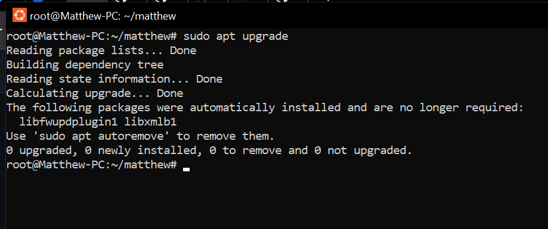

#### 2. PWD command

This command is use to find the path of your current/present working directory.

The pwd command uses the following syntax:

`pwd [option]`

It has two acceptable options:

-L or logical - prints environment variable content, including symbolic links.

-P or physical - prints the actual path of the current directory.

`pwd`

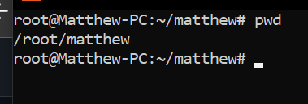

#### 3. cd command

This command is used to navigate through the Linux files and directories.

it uses the syntax below:

`cd [directory name]`

example:

`cd \DevOps_project\`

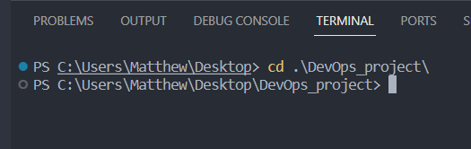

Running the command without an option will take you to the home folder.

Here are some shortcuts to help you navigate:

`cd ~[username]` - goes to another user's home directory.

`cd ..` moves one directory up.

`cd` moves to your previous directory

#### 4. ls command

This command lists files and directories within a system. Note that running it without a flag or parameter will return the current working directory's content.

To see other directories content, type ls followed by the desired path.

Take for example, to view files in the Documents folder, enter:

`ls Documents`

Below are other options for ls command:

`ls -R` - lists all files in the subdirectories.

`ls -a` - shows hidden files in addition to the visible ones.

`ls -lh` - shows the files in easily readable formats, such as MB, GB, and TB.

#### 5. cat command:

It lists, combines, and writes file content to the standard output. To run the cat command, type cat followed by the file name and it's extension. For example.

`cat linux.txt`

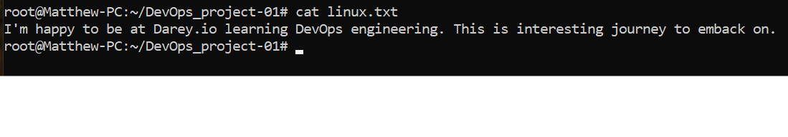

Here are other ways to use the cat command:

To merge filename1.txt and filename2.txt and store the output in filename3.txt

`cat filename1.txt filename2.txt > filename3.txt`

To display contents in reverse order.

`tac filename.txt`

#### 6. cp command:

This command is used to copy files or directories and their content. For instance:

` cp /root/DevOps_project-01/linux.txt DevOps`

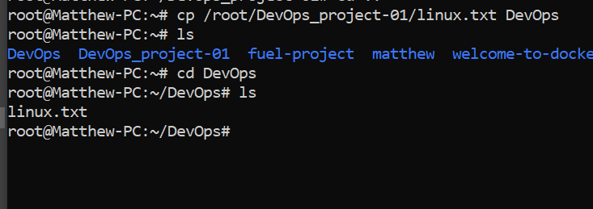

To copy the content of a file to a new file in the same directory:

`cp filename1.txt filename2.txt`

To copy an entire directory, pass -R flag before typing the source directory, followed by the destination directory.

`cp -R /root/DevOps /root/DevOps_project-01/`

#### 7. mv command

This command is primarily used to move and rename files and directories. It doesn't produce an output upon execution.

How to use: Type mv followed by the filename and the destination directory.

`mv linux.txt /root/DevOps`

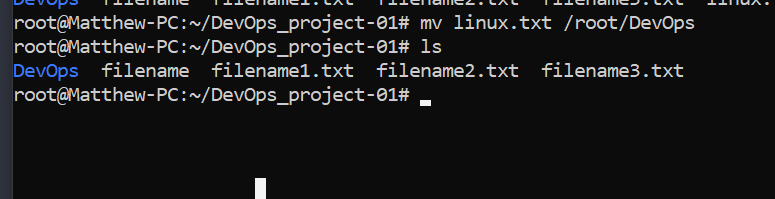

You can also use the mv command to rename a file:

`mv filename3.txt file3.txt`

#### 8.mkdir command.

This command is used to create one or multiple directories at once and set permissions for each of them.

Here's the basic syntax.

`mkdir [option] directory_name`

Example:

`mkdir Basics` - To make a new directory called Basic

To Create a new Directory called Learningpath inside Basics.

`mkdir Basics/Learning_path`

To make directory between two exsiting folders

`mkdir -p Basics/concept/Learning_path`

#### 9. rmdir command.

This command is used to parmanently delete an empty directory.

`rmdir -p Basics/Learning_path`

#### 10. rm command

This command is used to delete files within a directory. Make sure that the user performing this command has write permissions.

Here's the general syntax.

`rm filename`

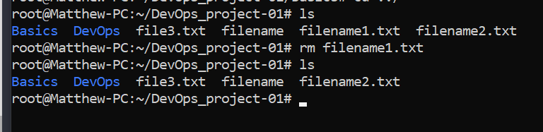

To Remove multiple files, enter the following command:

`rm filename1 filenemae2 filename3`

Other Acceptabel options:

- `-i`: Interactive mode. It will ask you before deleting any file.
- `-f`: Force removal without asking.

#### 11. touch command:

This command allows you to create an empty file or generate and modify a timestand in the Linux command line.

` touch my_project`
It creates a file named "my_project" if it does not exist already. If it exists, then it updates its timestamp (last modified)

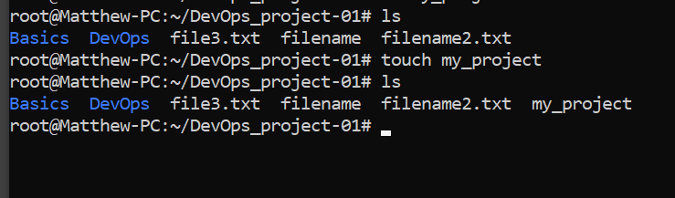

#### 12 locate command:

This command is used to find a file in the detabse system.

However, adding the -i argument will turn off case sensitivity.

Example:

`locate -i school*note`

#### 13. find command:

The command is use to search for files within a specific directory.

The general synthax is:

`find [option] [path] [expression]`

Example:

`find /root -name linux.txt`

#### 14. grep command:

grep is used to search for text patterns within files.

Example:

`grep content file3.txt`

This command search for the word 'content' in file3.txt and returns it in red.

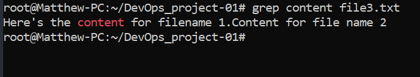

#### 15. df command:

df (disk free) reports file system disk space usage.

Here's the general synthax:

`df [options] [file]`

Example:

`df -h`

It shows all mounted filesystems and their sizes in human-readable format.

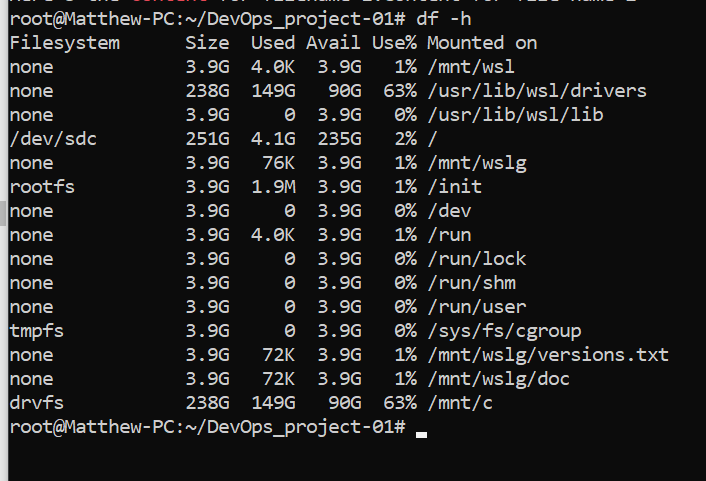

#### 16. du command:

It is used to check the how much space a file or directory takes up.

Example:

` du /root/DevOps`
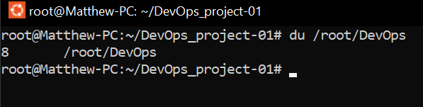

#### 17. head command:

The head command allows you to view the first 10 lines of a text.

The general syntax is:

`head [option] [file]`

Example: To view the first 10 lines of fruit.txt

`head fruit.txt`

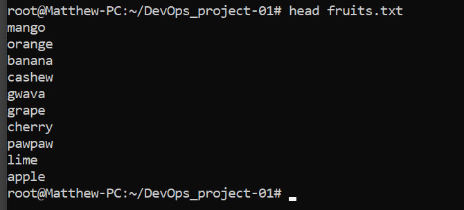

#### 18. tail command:

This command displays the last lines of a file. It allows users to check whether a file has new data or to read error messages.

Here's the general format:

`tail [option] [file]`

Example:

`tail -n fruit.txt`

#### 19. diff command:

short for difference. This command compares two content of a file line by line.

Here's the general format:

`diff [option] file1 file2`

Example:

`diff  newfruits.txt fruits.txt`

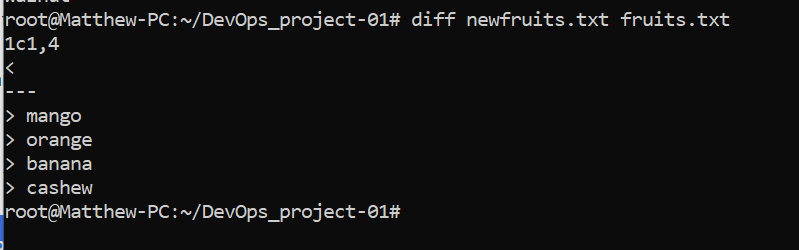

#### 20. tar command:

This command archives multiple files into a TAR file.

Here's the basic syntax:

`tar [options] [archive_file] [file or directory to be archieved]`

# File Permissions and Ownerships

#### 21. chmod command:

The chmod command is used to change the permissions on a file or a directory.

The general syntax is:

`chmod [option] [permission] [file_name]`

For example , the owner is currently the only one with permissionto change note.txt. To allow others to read, write , and execute the file, change it to the rwxrwxrwx permission type whose numeric value is 777 :

`chmod 777 newfruits`

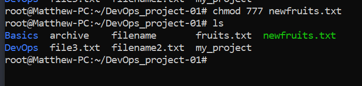

#### 22. chown command:

This command let you change the ownership of a file, directory, or symbolic link to a specified username.

The basic format is:

`chown [option] owner[:group] file(s)`

#### 23. jobs command:

This command displays information about currently running background processes in Unix-like operating systems. The output includes process ID (PID), user name, job.

This command is only available in csh,bash,tcsh and ksh shells.

The basic syntax is:

`jobs [options] jobID`

to check the status of jobs in the current shell , simply enter jobs to the CLI.

#### 24. kill command:

This command allows you to send signals to processes running in your terminal. You can use it to stop (kill) long-running tasks that are.

To kill a program, you must know it's process identification number (PID). If you don't know the PID, run th following command.

`ps ux`

After knowing what signal to use and the program's PID, enter the following syntax:

`kill [signal_option] pid`

There are 64 signals you can use , but the two most commonly used are :

SIGTERM requests a program to stop running and gives it some time to save all of its progress . SIGKILL forces programs to stop , and you will lose unsaved progress . for example the programs PID is 63773 and you want to force stop it :

#### 25. ping command:

This command is used for checking whether a network or a server is reachable. In addition, it is used to troubleshoot various connectivity issues.

The general syntax is:

`ping [option] [hostname_or_IP_address]`

Example: You want to know whether you can connect to Darey.io and measure its response time:

`ping darey.io`

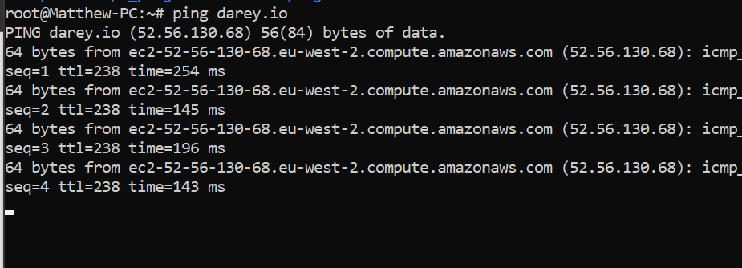

#### 26. wget command:

The command lets you download files frim the internet using the wget command. It works in the background without hindering other running processes.

It also retrieves files HTTP, HTTPS, and FTP protocols.

To use it, enter the following command:
`wget [option] [url]`

Example: Enter the following command to download the latest version of wordpress:

`wget https://wordpress.org/latest.zip`

#### 27. uname command:

This command will rpint detailed information about your Linux system and hardware.

Here's the basic syntax:

`uname [option]`

The acceptable options are:
-a prints all the system information.
-s prints the kernel name.
-n prints the system's node hostname.

#### 28. top command:

This command will display all the running processes and a dynamic real-time view of the current system.

It can also help to identify and terminate a process that may use too many system resources.

run

`top`

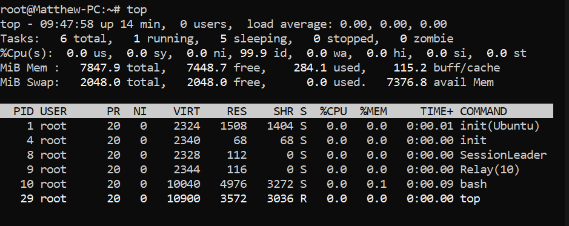

#### 28. history command:

With history, The system will list up to 500 previously executed commands, allowing you to reuse them without re-entering. Note that only users with sudo privileges can execute this command.

`history [option]`

It supports the following commands:

-c clears the complete history list.

-d offset deletes the history entry at the OFFSET position.

-a appends histroy lines.

#### 30. man command:

This command provides a manual fo any command or utilities you can run in Terminal, including the name, description, and options.

To display the complete manual, enter:

`man [command_name]`

Example:

`man ls`
This opens up the manual page for the 'ls' command in most Unix systems.

#### 31. echo command:
The `echo` command is used to write arguments to standard output. By default, it outputs whatever follows the command itself on the same line.

Here's the basic syntax:

`echo [option] [string]`

The command also supports many options, such as:

-n displays the output without the trailing newline.
-e enables the interpretation of the following backslash escapes: \a plays sounds alert. \b removes spaces in between a text. \c produces no further output.

#### 32. zip, unzip commands:
These are used to create and extract .ZIP files on UNIX or Linux system.

Ths zip command is also useful for archiving files and directories and reducing disk usage.

Here's the general syntax:

`zip [options] zipfile file1 file2`

`zip archive.zip fruits.txt`

`unzip archive.zip`

#### 33. hostname command:
Run the hostname command to know the system's hostname. Note that you can execute it with or without an option.

Here's the general syntax.

`hostname [option]`

Example: 

`hostname -i`

#### 34. useradd. userdel commands:
These commands are used to add a new user account or delete an existing one from your system.

Syntax: `useradd [option] username`

To set the password:

`passwd username`

Delete User Account:

`userdel [-r] username`

Example: To add new user Benson;

`useradd benson`

To delete:

`userdel username`

#### 35. apt-get command:
The apt-get command is used in Debian based systems like Ubuntu, Linux Mint etc. It allows you to install software packages from the default.

syntax: `apt-get [options] (command)`

#### 36. nano, vi, jed commands:

nano, vi or jed are text editors installed on linux.
nano and vi come with the operating, while vi has to be installed.

Examples:

`nano fruit.txt`

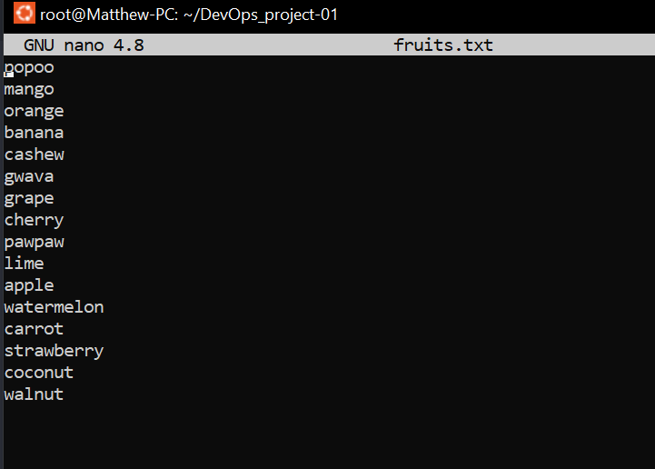

`vi fruit.txt`

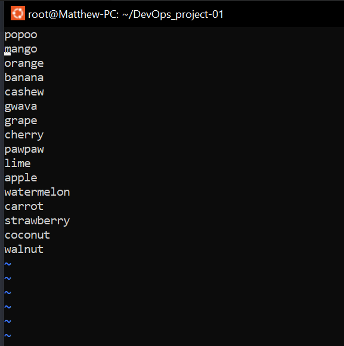

#### 37. alias. unalias commands:
Aliases allow you to create shortcuts for long commands that you use frequently. They can save time when typing in commands at the terminal prompt.

syntax:

`alias Name=String`

For Example:

If you want to make k the alias for the kill command:

`alias k='kill'`

on the other hand, the unalias command deletes an existing alias.
Syntax:

`unalias name`

For example:

`unlias k`

#### 38. su command:
This command allows you to run a program a sa different user. This command is especially beneficial for accessing the system through SSH or using the GUI display manager when the root user is unavailable.

syntax:

`su [options] [username] [argument]`

#### 39. htop command:
The htop command is an interactive program that monitors system resources and server processes in real time.

syntax:

`htop [options]`

The options innclude:

-d - shows the delay between updates in tenth of seconds.

-C enables the monochrome mode. 

-h -help displays the help message and exit.

#### 40. ps command:
This command produces a snapshot of all running processes in your system.
syntax:

`ps [options]`

Options include:

-A All processes except session leaders (default).
-u Username or UID.

-g Group ID.

-p PID Process ID.
-t TTY.

-T Show full command line instead of just process names.

  

