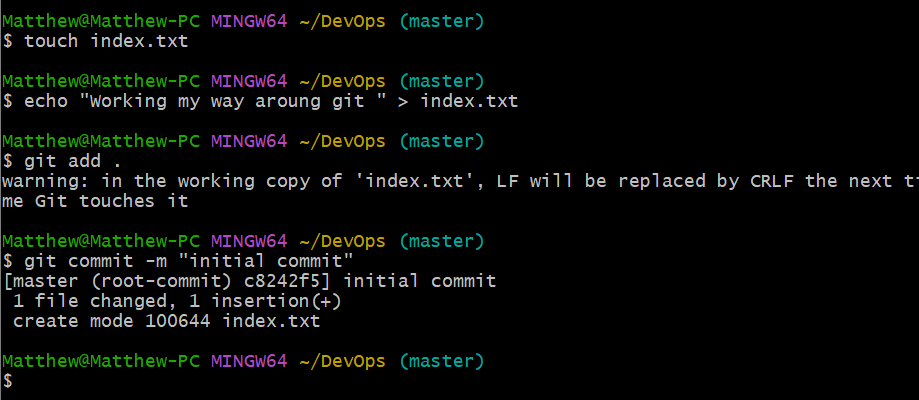
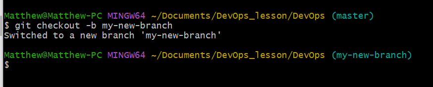
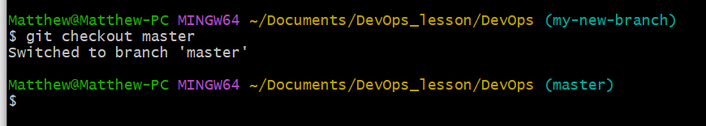
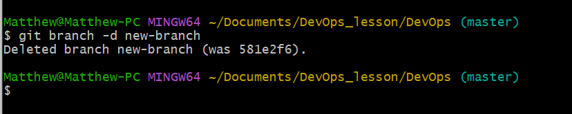
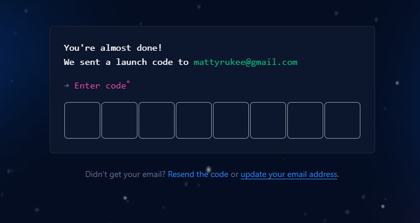
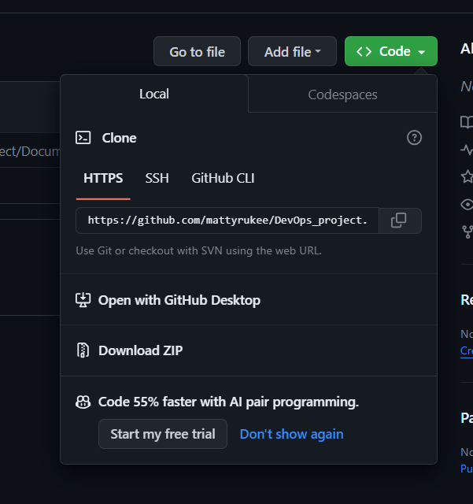
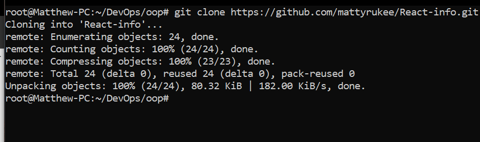

# Git Project
Git is a powerful version control system widely used in software development. Git is known for its efficiency, speed, and ability to work offline.

## Initializing a Git Repository.

Before initializing a git repo, you must have installed git in you computer.

Click on [Install Git](https://git-scm.com/downloads), Choose your operating system (windows, mac, linux). Click on download and install. Git bash originally get installed in your computer.

Now to initializ a git repo, follow these steps:

* Open a terminal on your computer, eg git bash.

* On your terminal create your working folder or directory eg DevOps_project folder using this command `mkdir DevOps`

* Change or move into your working directory using this command `cd Devops`

* While you are inside the folder, run `git init` command. This will initialize a new repository.

### Making the first commit:

Commit is more or less saving the changes you made to your files. Changes can be adding, modifying or deleting files or text.

When a commit is made, git takes a snapshot of the current state of your repository and saves a copy in the .git folder inside your working directory.

Steps to making the first commit:

* Inside the working directory create a file index.txt using the command `touch index.txt`

* Write any sentence of your choice inside the text file. Afterwards, save your changes.

* Add the changes to git staging area using this command `git add .`

* To commit the changes to git, run the command `git commit -m "initial commit"`

### Working with Branches.

A git branch is commonly used to develop new features of your application. It helps to create a copy of your cource code. There you can make changes as you please.

Git branch is also an important tool for collaboration within remote teams.

#### Making your first git Branch.
To make a new branch, run `git checkout -b`

The-b flag helps to create and change into a new branch.

With that said let's make our first branch following these steps:

* run git checkout `-b my-new-branch`

#### Listing Your git Branches

The command below helps to list the branches on your local git repository.

`git branch`

#### Change into an Old Branch

Run:
`git chechout <branch-name>`

#### Merging a Branch into another Branch

Let's say we have two branches master and my-new-branch. And we want to add the content of my-new-branc into master.

First we change into branch master and run the git command below:

`git merge my-new-branch`

#### Deleting a Branch

first switch to the master branch and run this command:

`git branch -d <branch name>`

## Collaboration and Remote Repositories
 Remote teams can view, update and make changes to the same repository through the help of *Github*

 Github is a web based platform where git repositories are hosted. By hosting our local git repository on github, it becomes available in the public internet.

 ### Creating a Github Account

 step 1: Head over to  [github.com](https://github.com/signup)

 step 2: Next enter your email, password, username, and complete the captcha.

 step 3: Click on "Sign up for GitHub" button.

 

step 5: Confirm the activation code sent to your mail.

step 6: Select your preference and click continue.

step 7: click continue

#### Creating your First Repository

step 1: click on the plus sign at the top right corner of your github account. A drop down menu will appear, select new repository.

step 2: fill out the forem by adding a unique repository name, description and ticking the box to add a Readme.md file.

step 3: click the green button to create your repository.

#### Pushing your Local git Repository to your Remote gitbuh Repository.

Having created a github account and a github repository with the guide above, Let's send a copy of our story to our repository in github.

We will achieve this by following teh steps bellow:

 * Add a remote repository to the local repository using the command below.

 `git remote add origin <link to your github repo>`

 To get the remote link click on the green button code, copy the https link. 

See below image:

 * After commiting your changes in your local repo. You push the content to the remote repo using the command below:

 `git push orgin <branch name>`

 Note: The word origin refers to your remote repo link, it evaluates to the remote url. If can be any word you choose.

 ### Cloning Remote Git Repository

 The git clone command helps us to make a copy of remote repository in our local machine. It is a git tool for downloading remote repository into our local machine. 

 Run:

 `git clone <link to your remote repository>`

 

## Branch Management and tagging

### Introduction to Markdown Syntax.

Markdown syntax is a lightweight markup language that is widely used for formatting plain text.

Here is th most commonly used markdown syntax elements:

1. Headings: To create heading, use the hash symbol at the beginning of the line. The number of hash symbol used indicate the level of the heading.

`# Heading 1`

`## Heading 2`

`### Heading 3`

`#### Heading 4`

`##### Heading 5`

2. Emphasis: asterisks or underscore is used to emphasize text.

`*italic*` or _italic_
`**bold**` or __bold__

3. Lists: markdown has support for both ordered and unordered list

`- Item 1`

`- Item 2`

`_ Item 3`

ordered list example:

`1. First item`

`2. Second item`

`3. Third item`

4. Links: To create a hyperlin, use square brackets for the link text followed by parentheses containing URL.

example:

`[visit darey.io](https://www.darey.io)`

5. images: To display an image, use an exclamation mark followed by square brackets for the alt and parenthese containing the image URL.

6. Code: To display code or code snippets, use backticks (``) to enclose the code.

example: 

 `` `console.log ('welcome to darey.io)` ``

 

