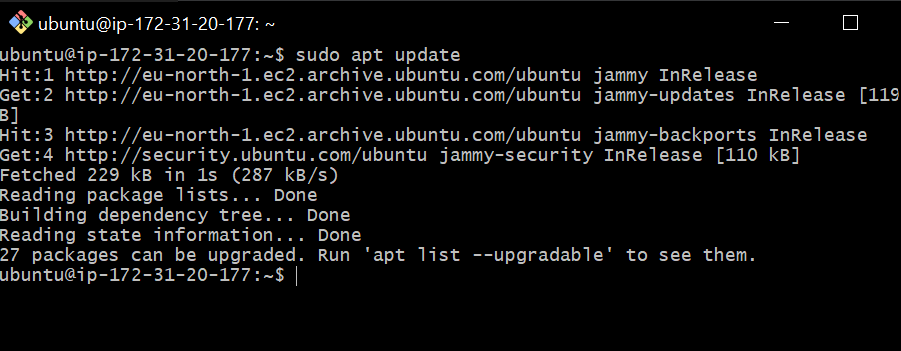
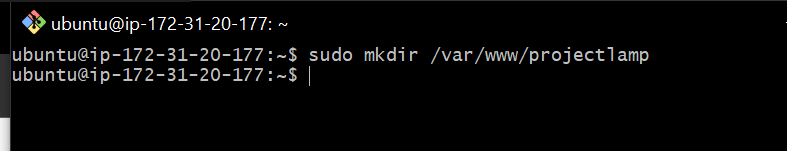
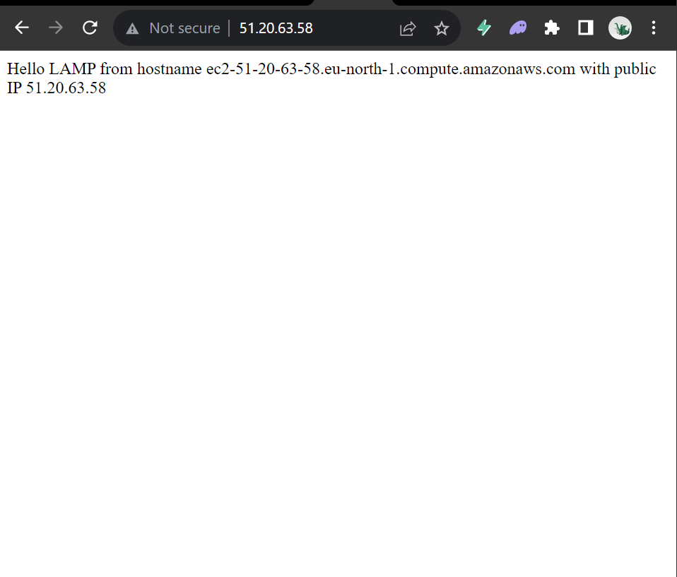
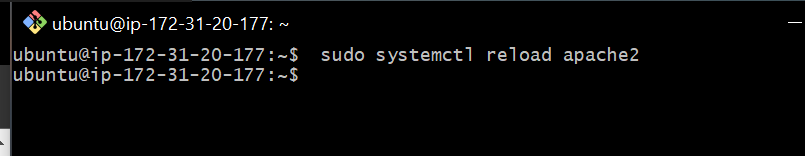
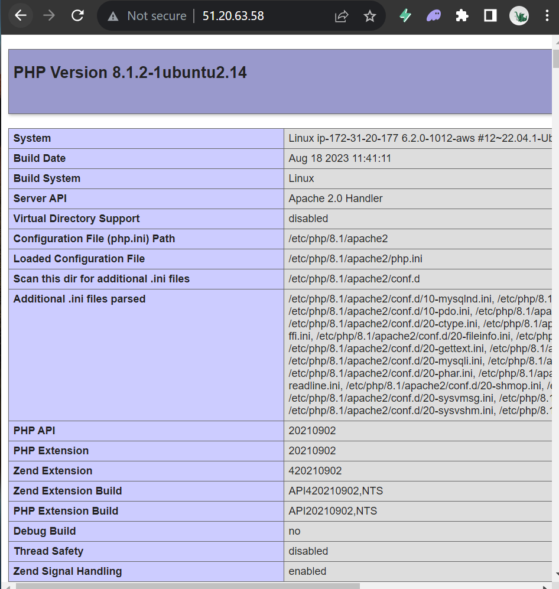

# Lamp Stack Implementation

A technology stack is a set of framework and tools used to develop a software product. Listed below are acronymns for individual technologies used together for a specific technology product:

- LAMP (Linux, Apache, MySQL, PHP or Python, or Perl)
- LEMP (Linux, Nginx, MySQL, PHP or Python, or Perl)
- MERN (MongoDB, ExpressJS, ReactJS, NodeJS)
- MEAN (MongoDB, ExpressJS, AngularJS, NodeJS)

## Preparing prerequisites:

<strong>Step 0 - Preparing prerequisites </strong>
In order to complete this project you will need an AWS account and a vittual server wit Ubuntu Server OS.

AWS is the biggest Cloud Service Provider and it offers a free tier account that that we are going to leverage for our project. AWS can provide us with a free virtual server called EC2 (Elastic Compute Cloud) for our needs.

Spinning up a new EC2 instance (an instance of a virtual server) is only a matter of a few clicks.

You can either Watch the videos below to get yourself set up.

1.  [AWS account setup and Provisioning an Ubuntu Server](https://www.youtube.com/watch?v=xxKuB9kJoYM&list=PLtPuNR8I4TvkwU7Zu0l0G_uwtSUXLckvh&index=6) 2.[Connecting to your EC2 Instance](https://www.youtube.com/watch?v=TxT6PNJts-s&list=PLtPuNR8I4TvkwU7Zu0l0G_uwtSUXLckvh&index=8)

Or follow the instructions below.

1. Register a new AWS account following [this instruction](https://repost.aws/knowledge-center/create-and-activate-aws-account)

2. Select your preferred region (the closest to you) and launch a new EC2 instance of t2.micro family with Server 20.04 LTS (HVM)

<bold>IMPORTANT</bold> - save your private kep (,pem file) securely and do not share it with anyone: If you lose it, you will not be able to connect to yoyr server ever again.

3. Connecting to EC2 using our Terminal.

Open gitbash (or your prefered terminal)

`cd Downloads`

4. connect to the instance by running

`ssh -i "matty-ec2.pem" ubuntu@ec2-51-20-63-58.eu-north-1.compute.amazonaws.com`

Note: You can get this details by clicking on connect and then SSH in your AWS console.

Here's what you get when you paste the code in your terminal:

Now we are connected!

## Installing Apache and Updating the Firewall

#### Step 1 - Installing Apache and Updating the Firewall

Apache HTTP Server is the most widely used web server software. Apache is an open source software availabel for free. It can be higly customized to meet the needs of many different environments by using extensions and modules.

Install Apache using Ubuntu's package manager 'apt':

Run the code below

`$ sudo apt update`

Run apache2 package installation

`$ sudo apt install apache2`

Check if it is installed correctly

`$ sudo systemctl status apache2`

You should see something like this, which means that everything went well:

Before we can receive any tracffic by our Web Server, we need to open TCP pots 80 which is the default port that web browsers use to access web pages on the internet.

Before now, only TCP port 22 is open by default on our EC2 machine to access via SSH, we need to add a rule to EC2 configuration to open inbound connection through port 80:

Navigate to security after ticking the instance box in your ec2.

Click on Add Rule at the bottom of the page.

Our server is up and running and we can access it locally and from the intenet

To access it locally in our Ubuntu shell, run:

`$ curl http://localhost:80`

OR

`$ curl http://127.0.0.1:80`

The two commands above actually do the same. They use 'curl' command to request our Apache HTTP Server on prot 80. While the first command access via DNS name, the second command access by IP address.

To test how Apache HTTP server can respond to requests from the internet, Open a web browser and try to access the following url.

`http://<Your-Public-Ip-Address>:80`

You should get something like this:

Another way to retrieve your Public IP address, other than to check it in AWS web console, is to use the following command.

`curl -s http://169.254.169.254/latest/meta-data/public-ipv4`

# Installing Mysql

Step 2: Installing MySQL

Now that you have a web server up and running, you need to install a Database Management System (DBMS) to be able to store and manage data for your site in a relational database.

MySQL is a popular relational database management system used within PHP environmnets.

To install, run 

`sudo apt install mysql-server`

You will be required to confirm the installation, type Y, and ENTER.

When installation is complete, log into MYSQL console by running:

`sudo mysql`

This will connect to the MYSQL server as the administrative database user root.

It's recommendedt that you run a security script that comes pre-installed with MYSQL. This script will remove some insecure default settings and lock down access to your detabase system.

Before running the script you will se a password for the root user, using mysql_password as efault authentication method. We are definning this user's password as `PassWord.1`

`ALTER USER 'root'@'localhost' IDENTIFIED WITH mysql_native_password BY 'PassWord.1';
`

Exit the MySQL shell with 

*mysql* `exit`

Start the interactive script by running:

`sudo mysql_secure_installation`

This will ask if you want to configure the `VALIDATE PASSWORD PLUGIN`.

If enabled, passwords which don't match the specified criteria will be rejected by MYSQL with an error. It is safe to leave validation disabled, but you should always use strong, unique passwords for database credential.

Regardless of whether you chose to set up the  `VALIDATE PASSWORD PLUGIN`, your server will next ask you to select and confirm a passwird for the MySQL root user. This is not to be confused with the system root. The database root user is an adminstrative user with full priviledges over the database system.

When done, test if you are able to log into the mYSQL console by running 

`sudo mysql -p`

The -p flag prompt you to enter a password

To Exit

`exit`

# Installing PHP

Step 3: Installing PHP

Start by installing `libapache2-mod-php` to enable Apache to handle PHP files. Core PHP packages will automatically be installed as dependadencies.

To install these 3 packages at once, run:

`sudo apt install php libapache2 mod-php php-mysql`

Click Y when prompted to.

Once installation is complete, run the following command to confirm your PHP version:

`php -v`

At this point, your LAMP stack is completely installed and fully operational.

*  Linux (Ubuntu)
* Apache HTTP Server 
* MySQL Database
* PHP 

## Creating a Virtual Host for our website

Step 4: Creating a virtual Host for oue website using Apache

Firstly, we need to create a new file in `/etc/apache2/mods-enabled/` called `dir.conf` and change the order in which the index.php file is lised within the Directory directive:

run:

`sudo vim /etc/apache2/mods-enabled/dir.conf`

## Creating a Virtual Host for your website Uisng Apache

A virtual host allows you to have multiple websites located on a single machine and users of the websites will not even notice it.

First, create a directory, call it `projectlamp` using 'mkdir' command:

`sudo mkdir /var/www/projectlamp`

Assign ownership of the directory with the `$USER` environment varaible, whcih will refrence your current system user:

`sudo chown -R $USER:$USER /var/www/projectlamp`

Next, create and open a new configuration file in Apache's `sites-available` using any editor

`sudo vim /etc/apache2/sites-available/projectlamp.conf`

Enable the new virtual host:

`sudo a2ensite projectlamp`

Disable the default website that comes installed with Apache:

`sudo a2dissite 000-default`

To ensure the configuration file doesn't contain syntax errors, run:

`sudo apache2ct1 configest`

You can ls to ensure your files are there:

`ls /etc/apache2/sites-available`

Your new site is now active bt the web root /var/www/projectlamp is still empty. Create an index.html file in that location so that we can test the virtual host works as expected:

`sudo echo 'Hello LAMP from hostname' $(curl -s http://169.254.169.254/latest/meta-data/public-hostname) 'with public IP' $(curl -s http://169.254.169.254/latest/meta-data/public-ipv4) > /var/www/projectlamp/index.html
`
Go to your browser and try to open your website URL using IP address:

`http://<Public-IP-Address>:80
`

# Enable PHP on the Website

Step 5: Enable PHP on the website.

With the default <strong>DirectoryIndex</strong> settings on Apache, a file named `index.html` will always take precedence over an `index.php` file. This is useful for setting up maintenance pages in PHP applications, by creating a temporary index.html file containing an informative message to visitors. 

Because this page will take precedence over the index.php page, it will then become the landing page for the application. Once maintenance is over, the index.html is renamed or removed from the document root, bringing back the regular application page.

In case you want to change this behavior, you’ll need to edit the <strong>/etc/apache2/mods-enabled/dir.conf</strong> file and modify the order in which the <strong>index.php</strong> file is listed within the <strong>DirectoryIndex</strong> directive:

`sudo vim /etc/apache2/mods-enabled/dir.conf
`

After saving and closing the file, you will need to reload Apache so that changes take effect:

` sudo systemctl reload apache2
`

Finally, wcreate a PHP script to test that PHP is correctly installed and configured on you server.

Cretae a new file named `index.php` inside your custom web root folder:

` vim /var/www/projectlamp/index.php
`
Paste the following code into it:

`<?php
phpinfo();
`

Save and exit. Refresh your page on browser and you will see this:

Now the PHP installation is working as expected.

Now, remove the file created as it contains sensitive information about the PHP environment.

` sudo rm /var/www/projectlamp/index.php
`
 

