# Web Stack Implementation (Lemp Stack)

WEB STACK IMPLEMENTATION (LEMP STACK)

# Installing the Nginx Web Server

Nginx is a high performance web server.

First, connect to the aws instance through ssh.

Step 1 - Installing the Nginx Web Server

Run the following commands:

`sudo apt update`

Enter Y when promted.

Next

`sudo apt install nginx`

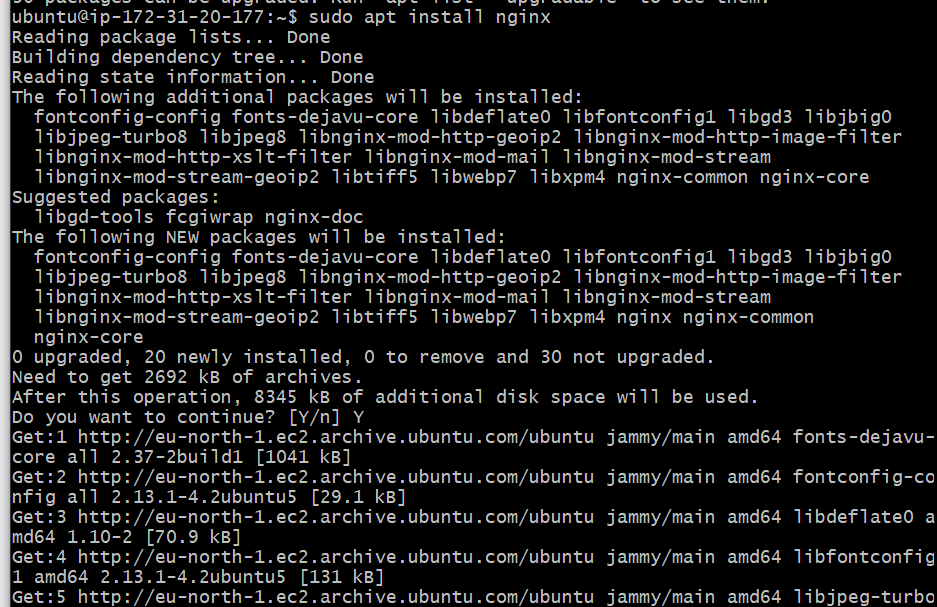

To verify ngnix was successfully installed and is running as a service in Ubuntu, run:

`sudo systemctl status ngnix`

If it is green as shown in the image, then everything is working fine.

Before we can receive any traffic by our web server, we need to open TCP port 80.

Head over to your AWS console and add the port 80.

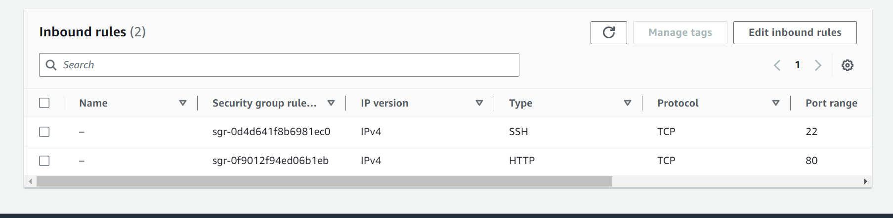

Let's access the server locally in our Ubuntu shell, runn:

` curl http://localhost:80`

or

`curl http://127.0.0.1:80`

To test how the Ngnix server can respond to requests from the internet, Open a web server and access through the following url.

`http://<Public-IP-Address>:80
`

If you see the above image, then you rweb server is now correctly installed and accessible through your firewall.

# Installing MySQL

Step 2 - Installing MySQL

Now that we have our web server up and running, you need to install a Database Management System (DBMS) to be able to store and manage data for our site in a relational database.

Run

`sudo apt install mysql-server`

Type Y and Enter when prompted.

When installation is complete, log in to the MySQL console by typing:

`sudo mysql`

To remove some insecure default settings that comes pre-installed with MySQL, run:

`ALTER USER 'root'@'localhost' IDENTIFIED WITH mysql_native_password BY 'PassWord.1';
`

Exit the MySQL shell with:

`exit`

Start the interactive script by running:

`sudo mysql_secure_installation`

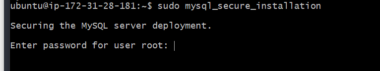

It requires you to enter root user password. Note that the password does not show so you just keep typing and click enter when done.

Afer login, Enter no if you do not want to create a password for the detabase.

For the rest of the questions, press `Y` and click `ENTER`

When you are finished, test if you are able to log in to the MYSQL console by typing:

`sudo mysql -p`

Exit MySQL

`exit`

NOw MySQL server is now installed and secured. Next, we will install PHP, the final component in the LEMP stack.

# Installing PHP

PHP is used to process code and generate dynamic content for the web server.

While Apache embeds the PHP interpreter in each request, Nginx requires an external program to handle PHP processing and act as a bridge between the PHP interpreter itself and the web server. This allows for a better overall performance in most PHP-based websites, but it requires additional configuration.

You’ll need to install php-fpm, which stands for “PHP fastCGI process manager”, and tell Nginx to pass PHP requests to this software for processing. Additionally, you’ll need php-mysql, a PHP module that allows PHP to communicate with MySQL-based databases. Core PHP packages will automatically be installed as dependencies.

To install these 2 packages at once, run:

`sudo apt install php-fpm php-mysql
`

Whne prompted, type `Y` and press `ENTER` to confirm installation.

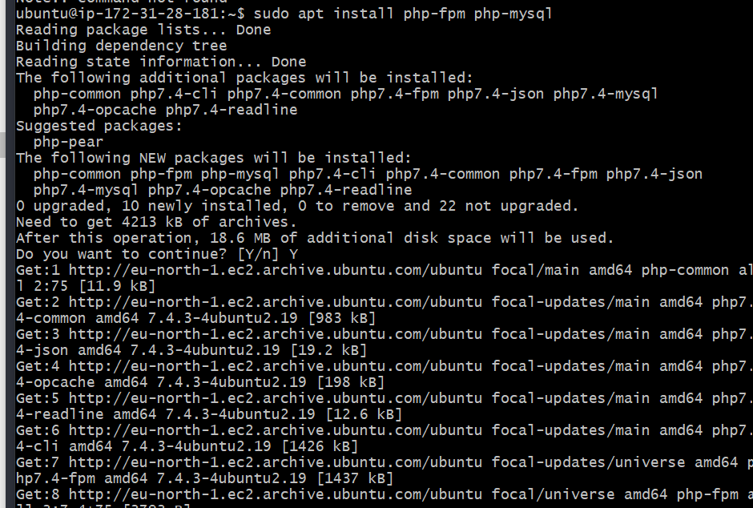

PHP components are now installed. Next, we will configure Nginx to use them.

# Configuring Nginx to Use PHP Processor

step 4 - Configuring Ngnix to Use PHP Processor

Here, we will create a different directory strructure within the `/var/www` to serve documents outside the `/var/www/html` directory.

Create the root web directort for <strong>your_domain</strong>
as follows:

projectLEMP in this case.

`sudo mkdir /var/www/projectLEMP`

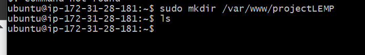

Assign ownership of the directory with the $USER environment variable, which will refrence your current system user:

`sudo chown -R $USER:$USER /var/www/projectLEMP
`

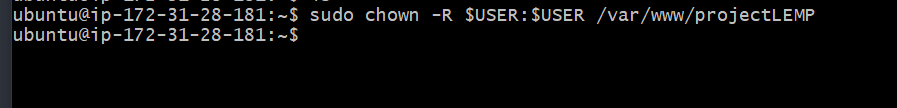

Next, open a new configuration file in Nginx's `sites-available` directory using your preferred command -line editor.

`sudo vim /etc/nginx/sites-available/projectLEMP
`

paste the following text into the blank file.

`#/etc/nginx/sites-available/projectLEMP

server {
listen 80;
server_name projectLEMP www.projectLEMP;
root /var/www/projectLEMP;

    index index.html index.htm index.php;

    location / {
        try_files $uri $uri/ =404;
    }

    location ~ \.php$ {
        include snippets/fastcgi-php.conf;
        fastcgi_pass unix:/var/run/php/php8.1-fpm.sock;
     }

    location ~ /\.ht {
        deny all;
    }

}
`

Here’s what each of these directives and location blocks do:

listen — Defines what port Nginx will listen on. In this case, it will listen on port 80, the default port for HTTP.

root — Defines the document root where the files served by this website are stored.

index — Defines in which order Nginx will prioritize index files for this website. It is a common practice to list index.html files with a higher precedence than index.php files to allow for quickly setting up a maintenance landing page in PHP applications. You can adjust these settings to better suit your application needs.

server_name — Defines which domain names and/or IP addresses this server block should respond for. Point this directive to your server’s domain name or public IP address.

location / — The first location block includes a try_files directive, which checks for the existence of files or directories matching a URI request. If Nginx cannot find the appropriate resource, it will return a 404 error.

location ~ \.php$ — This location block handles the actual PHP processing by pointing Nginx to the fastcgi-php.conf configuration file and the php7.4-fpm.sock file, which declares what socket is associated with php-fpm.

location ~ /\.ht — The last location block deals with .htaccess files, which Nginx does not process. By adding the deny all directive, if any .htaccess files happen to find their way into the document root ,they will not be served to visitors. When you’re done editing, save and close the file. If you’re using nano, you can do so by typing CTRL+X and then y and ENTER to confirm.

Save and Exit.

Next, Activate your configuration by linking to the config file from Nginx's `sites-enables` directory:

This will tell Nginx to use the configuration next time it is reloaded.

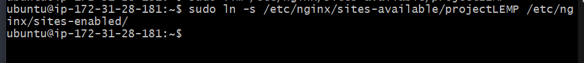

Test the configuration for syntax errors by running:

`sudo nginx -t`

If any errors are reported, go back to your configuration file to review its contents before continuing.

Next, we need to disable default Nginx host that is currently configured to listen on port 80, run:

`sudo unlink /etc/nginx/sites-enabled/default
`

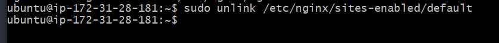

Now you can start Nginx with:

`sudo systemctl reload nginx
`

Your new website is now active, but the web root /var/www/projectLEMP is still empty. Create an index.html file in that location so that we can test that your new server block works as expected :

`sudo echo 'Hello LEMP from hostname' $(curl -s http://169.254.169.254/latest/meta-data/public-hostname) 'with public IP' $(curl -s http://169.254.169.254/latest/meta-data/public-ipv4) > /var/www/projectLEMP/index.html
`

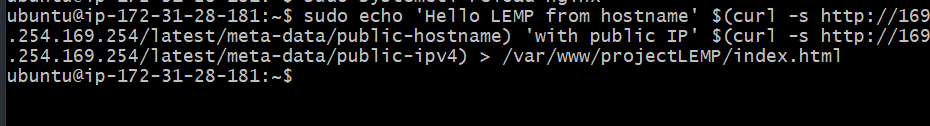

Now go to your browser and try to open your website URL using the IP address:

If you see the text from 'echo' command you wrote to index.html file, then it means your Nginx site is working as expected.

You can leave this file in place as a temporary landing page for your application until you set up an index.php file to replace it. Once you do that, remember to remove or rename the index.html file from your document root, as it would take precedence over an index.php file by default.

Your LEMP stack is now fully configured. In the next step, we’ll create a PHP script to test that Nginx is in fact able to handle .php files within your newly configured website.

# Testing PHP with Nginx

step 5 - Testing PHP with Nginx

Your LEMP stack should now be completely set up.

At this point, your LAMP LAMP stack is completely installed and fully operational.

You can test it to validate that Nginx can correctly hand `.php` files off to your PHP processor.

You can do this by creating a test PHP file in your document root. Open a new file called info.php within your document root in your text editor:

`vim /var/www/projectLEMP/info.php
`

paste this code in the file:

`<?php
phpinfo();
`

Save and Exit

You can now access this page in your web browser by visiting the domain name or public IP address you’ve set up in your Nginx configuration file, followed by /info.php :

After checking the relevant information about your PHP server through that page, it's best to remove the file you created as it contains sensitive information about your PHP environmnet and your Ubuntu server. run:

`sudo rm /var/www/your_domain/info.php`

# Retrieving data from MySQL database with PHP

Step 6 - retrieving data from MySQL database with PHP

In this step, we will create a a test database (DB) with simple "To do List" and configure access to it, so the Nginx website would be able to query data from it and display it.

At the time of this writing, the native MySQL PHP library mysqlnd doesn’t support caching_sha2_authentication, the default authentication method for MySQL 8. We’ll need to create a new user with the mysql_native_password authentication method in order to be able to connect to the MySQL database from PHP.

We’ll create a database named example_database and a user named example_user, but you can replace these names with different values.

First, connect to the MySQL console using the root account :

`sudo mysql`

If there a password,

`mysql -u root -p`

enter password.

To create a new database, run the following command:

`mysql> CREATE DATABASE `example_database`;
`

Now create a new user and grant full priviledges on the database.

`mysql>  CREATE USER 'example_user'@'%' IDENTIFIED WITH mysql_native_password BY 'PassWord.1';
`

Grant privileges for this user to access your newly created database.

Now exit the MySQL shell with:

`mysql exit`

You can test if the new user has the proper permissions by logging in to the MySQL console again, this time using the custom user credentials:

`mysql -u example_user -p`

Enter the example_user password.

Once logged in, run

`mysql> SHOW DATABASES;
`

Next, we'll create a test table named <strong>todo_list</strong>. From the MySQL console, run the following statement:

`CREATE TABLE example_database.todo_list (item_id INT AUTO_INCREMENT,content VARCHAR(255),PRIMARY KEY(item_id));
`

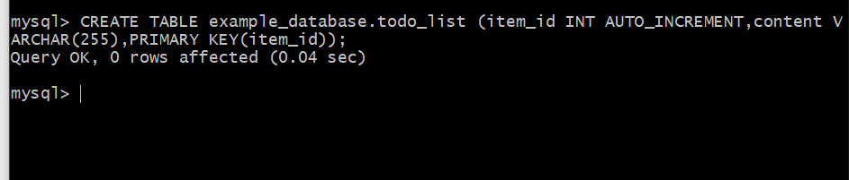

Insert a few rows of content in the test table. You might want to repeat the next command a few timesy, using different VALUES:

` INSERT INTO example_database.todo_list (content) VALUES ("My first important item");`

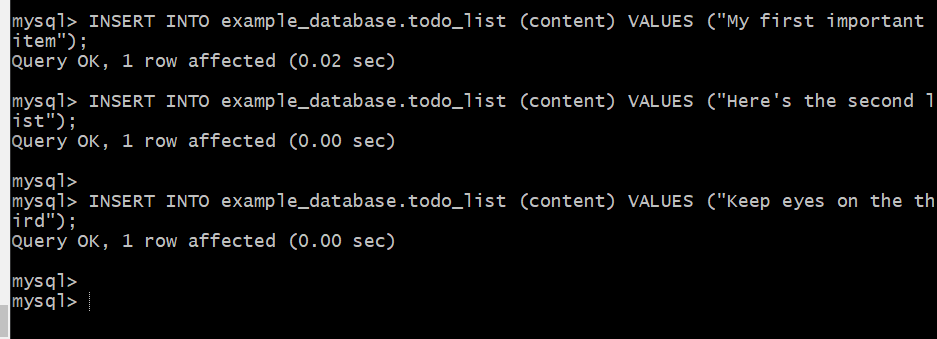

To confirm that the data was successfully saved to your table, run:

`mysql>  SELECT * FROM example_database.todo_list;`

Now exit mysql

`exit`

Now you can create the PHP script that will connect to MySQL and query for your content. Create a new PHP file in your custom web root directory using your preferred editor. We’ll use nano for that :

`nano /var/www/projectLEMP/todo_list.php`

paste this code into your `todo_list.php`

`<?php
$user = "example_user";
$password = "PassWord.1";
$database = "example_database";
$table = "todo_list";

try {
$db = new PDO("mysql:host=localhost;dbname=$database", $user, $password);
  echo "<h2>TODO</h2><ol>";
  foreach($db->query("SELECT content FROM $table") as $row) {
echo "<li>" . $row['content'] . "</li>";
}
echo "</ol>";
} catch (PDOException $e) {
print "Error!: " . $e->getMessage() . " ";
die();
}
`

Save and close the file when you are done editing.

You can now access this page in your web browserby visiting the domain name or publi IP address configure for your website, followed by `/todo_list.php:`

You should see a page like this, showing the content you've inserted in your test tables.

