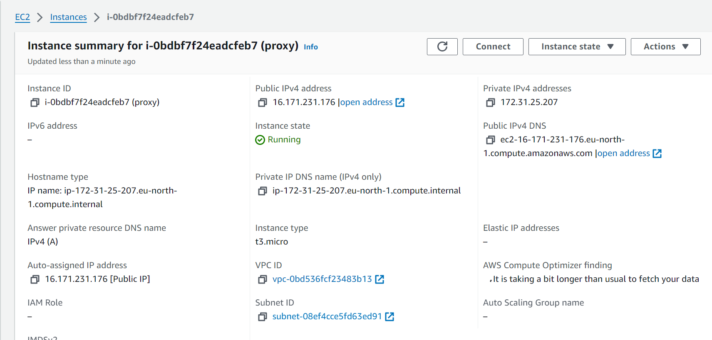
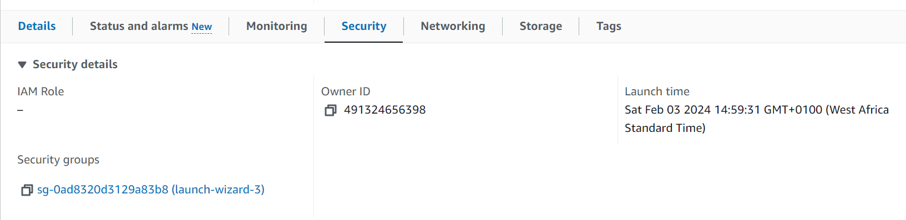
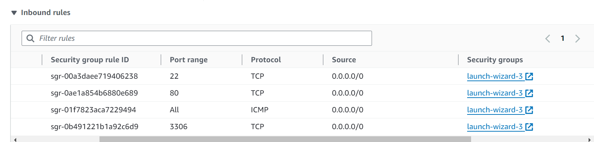
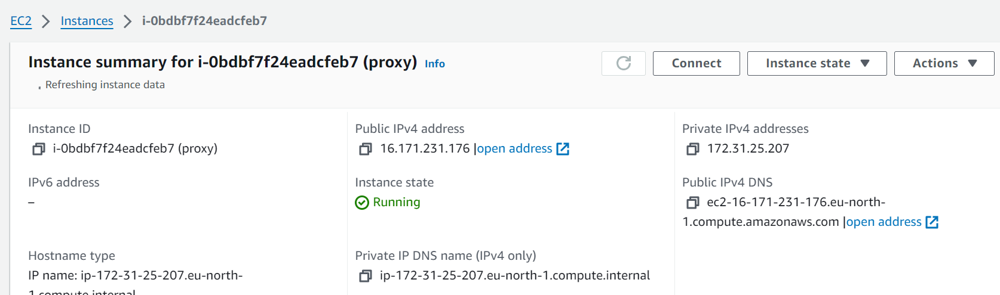
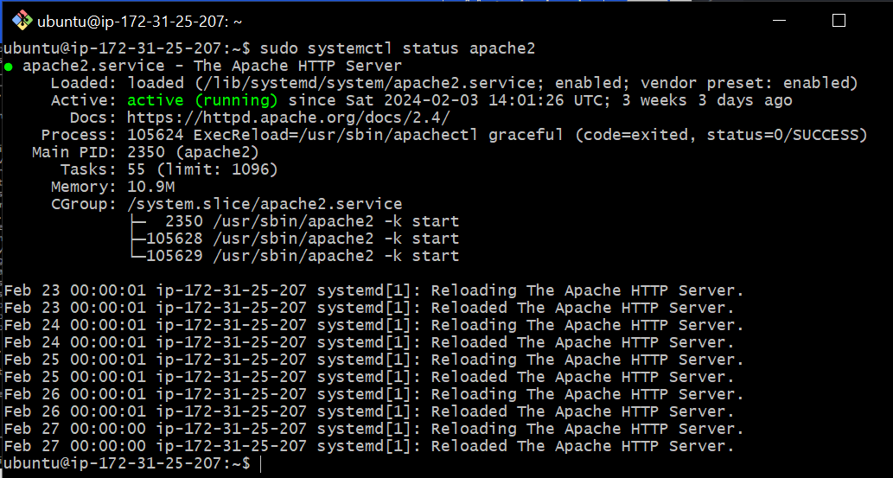
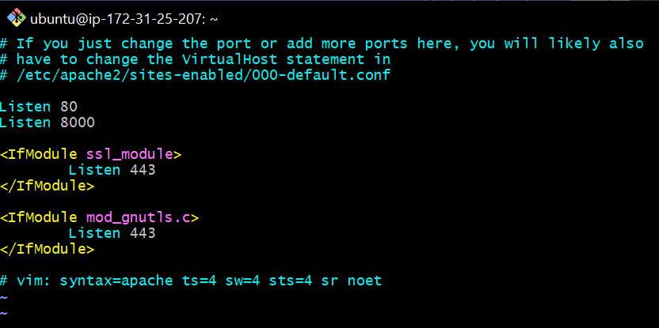
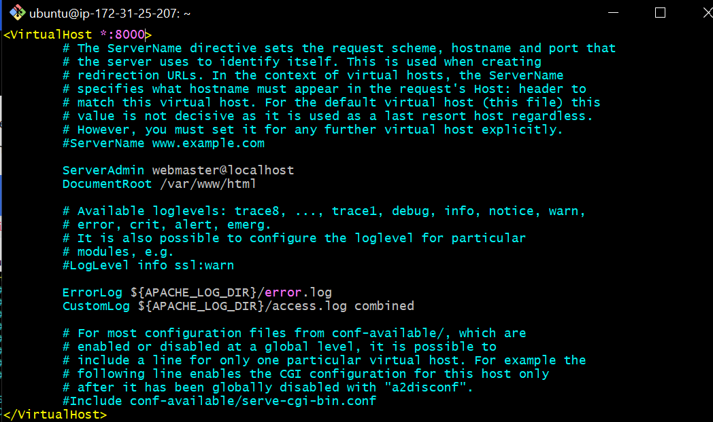
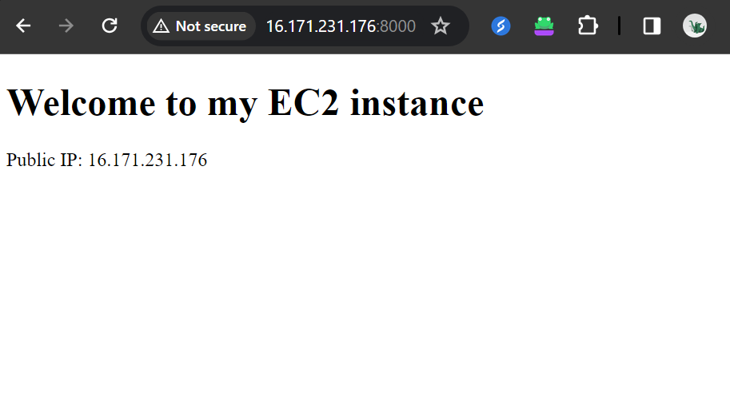
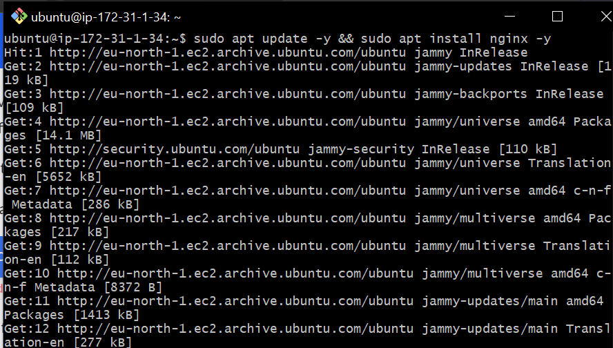

# Implementing Loadbalancers with Nginx

## Introduction to Load Balacing and Nginx

Loadbalacing means distributing the works or tasks among several computers or servers so that no one computer gets overloaded withtoo muchwork.

Nginx is a versatile software, it can act like a webserver, reverse proxy, and a load balancer etc. All that is needed is to configure it properly to serve your use case.

# Setting Up aBasic Load Balancer

We are going to be provisioning two EC2 instances running ubuntu 22.04 and install apache webserver in them. We will open port 8000 toallow traffic from anywere, and finally update the default page of the webservers to display  their public IP address.

<b>Step 1:</b> Provisioning EC2 instance
 - Go to the AWS Management Console, click on "EC2" in the services menu.
- Click on "Launch Instance". Select an AMI (Amazon Machine Image) that has Ubuntu Server installed. Choose an instance

- Choose an Instance Type (e.g., t2.micro).
  
  - Create a key pairor  use an existing one

  

  - Launch Instance

  <b>Step 2:</b> Open Port 8000  for HTTP traffic from anywhere. We will run our webservers on port 8000 while the load balancersruns on port 80.

  - click on the instance ID to get the details of your EC2 instance.

- scroll down and click on security:

- click on inbound and add rules.

 

 - add your rules

- click on save rules

<b>Step 3:</b>Install Apache Webserver

After provisioning both of the servers and have opened the necessary ports, its time to install apache software on both servers. We need to first connect to each of the webserver via ssh.

- connecting the webserver: To connect the webserver, click on your instance Id, at the top of the page click on connect.

- Next copy the ssh command, open a terminal on your local machine, cd into the folder where you have your key pair, paste the ssh command and click enter.

- Next install apache with the command below

`sudo apt update -y &&  sudo apt install apache2 -y`

- After installation verify if apache is running with

<b>Step 4:</b> Configure Apache to serve a page showing public IP.

Now, we willconfigure apachewebserver to serve content on port 8000 instead of its default which is port 80. Next, we will create a new index.htmp fil. The file will contain code to display the public IP of the EC2 instance. Afterward, we override apache webserver's default htmlfile with our new file.

- configure Apache to Server content on port 8000:

  1. Open /etc/apache2/ports.conf on your text editor

  `sudo vi /etc/apache2/ports.conf`

  2. Add a new Listen directive for port 8000. 

  

  3. Next open the file sudo vi /etc/apache2/sites-available/000-default.conf and change port 80 on the virtualhost to 800 likethe screenshot below:

  `sudo vi /etc/apache2/sites-available/000-default.conf`

 4. close the file

 5. Restart Apache to load the new configuration using the command below:

  `sudo systemctl restart apache2`

- Creating our new html file:

 1. Open a new index.html file with the command below.

 `sudo nano index.html`

 2. Paste the command below. 

        ` <!DOCTYPE html>
        <html>
        <head>
            <title>My EC2 Instance</title>
        </head>
        <body>
            <h1>Welcome to my EC2 instance</h1>
            
Public IP: YOUR_PUBLIC_IP

        </body>
        </html>`

Replace "YOUR_PUBLIC_ with the public ip from your instance.

3. change file ownership of the index.html file

`sudo chown www-data:www-data ./index.html`

- Override the default html file of Apache Webserver

- Replace the default html file with a new html file

1. `sudo cp -f ./index.html /var/www/html/index.html`
 2. Restart the webserver  again so that it will use the new custom page.

 `sudo systemctl restart apache2`

 

 You should see the below image when you load your IP on a web browser.

 

 <b>Step5 :</b> Configuring Nginx as a Load Balancer

 - We will create a new instance running on ubuntu 22.04. Open port 80 to accept traffic from anywhere

 - Next SSH into the instance. 

 - Install Nginx into the 

 `sudo apt update -y && sudo apt install nginx -y`

 - verify that Nginx is installed 

 `sudo systemctl status nginx`

 - Open Nginx configuration file

 `sudo vi /etc/nginx/conf.d/loadbalancer.conf`

 - Paste the configuration file below to configure nginx to act like a load balance.

 

- Tet your configuration 

`sudo nginx -t`

- restart Nginx to load the new configuration.

`sudo systemctl restart nginx`

Load your IP on a browser and you'll see the image below. Now your Nginx has been configured as a load balancer.

THANK YOU!!!

    

