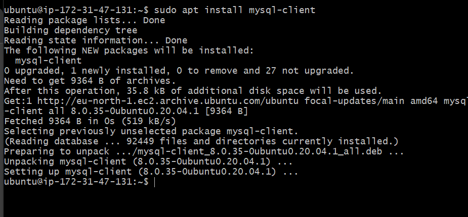
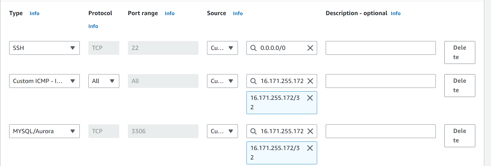
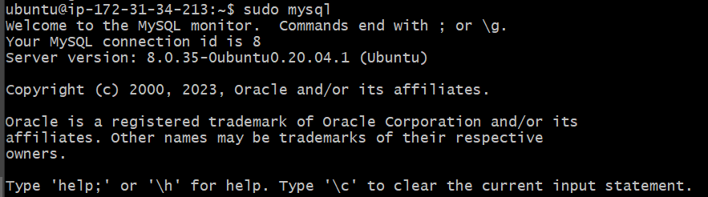
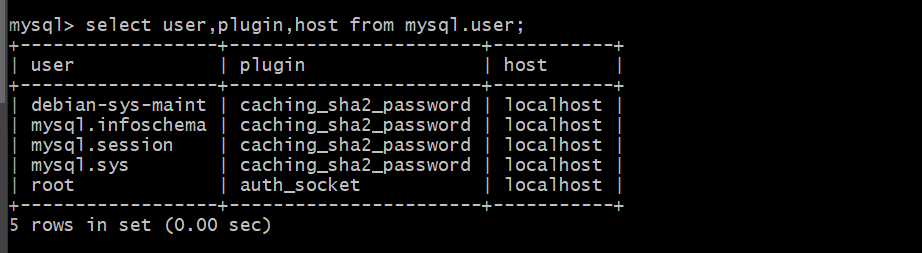

# Understanding Client server architecture with MySQL as RDBMS

Client-server refer to an architecture in which two or more computers are connected together over a network to senf and receive requests between one another.

The machine sending the request is usually referred as "client" and the machine responding (serving) is called "server"

The diagram below represent the web-server architecture.

.png)

In the above example, a machine that is trying to access a Web site using Web browser or simply curl command is a client and it sends HTTP requests to a Web server (Apache, Nginx, IIS or any other) over the internet.

Extending this concept further and adding a database server to our architecture, we can get the picture below.

In this case, our webserver has the role of a "Client" that connects and reads/writes to/from a Database (DB) server (MYSQL, MongoDB, Oracle, SQL server or any other) and the communication between them happens over a local Network (since it is a common practice the place the Web server and the DB server close to each other in a local Network) or through internet connection.

The setup above is a typical generic web stack architecture that we have already implement in LAMP and LEMP projects.

With refrence to using <strong>LAMP STACK</strong> website, let's deploy a wbesite called 
<a href="https://www.example.com" target="_blank">www.propitixhomes.com
</a>

By searching <a href="https://www.example.com" target="_blank">www.propitixhomes.com
</a> on your browser, your browser becomes the "Client" by sending request to the remote server and in turn wait fir response from the remote server.

Let's take a quick example and see Client-Server communication in action.

Open up your Ubuntun or Windows terminal and run the command below

`$ curl -Iv www.propitixhomes.com
`
In the above example, our terminal is the client while `www.propitixhomes.com` is the server.

In the response show above, You can see that the requests from the URL are being served by a computer with an IP address `72.2.115.196` and port 80.

## Implement a Client Sercer Architecture using MySQL Database Managemnet Sysytem (DBMS).

To demostrate a basic client-server using MySQL RDBMS, we will follow the procedures below.

1. Create and configure two Linux-based virtual servers (EC2 instances in AWS)

`Server A name - mysql server`
`Server B name - mysql client`

2. On `mysql server` Linux Server install MySQL Server software.

3. On `mysql client` Linux Server install MySQL Client software

4. By default, both of our EC2 virtual servers are located in the same local virtual network, so they can communicate with each other using local IP addresses. We use mysql server’s local IP address to connect from mysql client. MySQL server uses TCP port 3306 by default, so we must open it by creating a new entry in ‘Inbound rules’ in ‘mysql server’ Security Groups. For extra security, do not allow all IP addresses to reach the ‘mysql server.’ Only allow access to the specific local IP address of the ‘mysql client.

5. Configure the mySQL server to allow connection from remote hosts with the command below.

`sudo vi /etc/mysql/mysql.conf.d/mysqld.cnf 
`
Replace '127.0.0.1' to '0.0.0.0' like this.

 Next, we need to create a remote user that can access our database from remote hosts. First connect to our mysql database on the mysql server EC2 instance:

 `sudo mysql`

 

 List all users in the detabase using the command:

`select user,plugin,host from mysql.user;`

This displays a list of all users that can access our database. To create a new user:

CREATE USER 'Matty'@'16.171.255.172' IDENTIFIED WITH mysql_native_password BY 'Matty_pass';

To verify our new user has been created, we run the command:

`select user,plugin,host from mysql.user;`

User Matty is now created.

Connecting to database from MySQL Client EC2 instance.

After creating the remote user, we can go head to the mysql client EC2 instance shell and connect to the database by using the command:

mysql -h 16.171.255.172 -u Matty -p